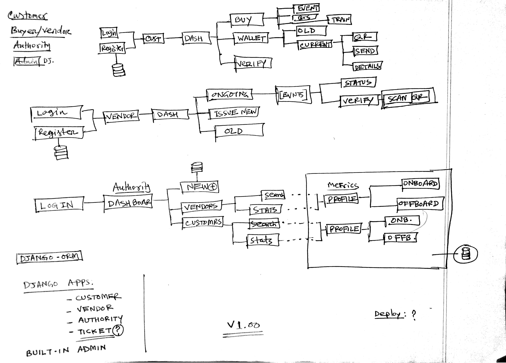

## Blockchain-Based-Online-Ticketing-Platform

### Web Application (Django)


#### Main Components
- User (Customer)
- Vendor (Different businesses that sells ticket)


#### How to add Braid to your project
Step 1: Add Braid to your dependencies
```
//Braid
    braid 'io.bluebank.braid:braid-server:4.1.2-RC13'
```

Step 2: Add generic function to start Braid
```
def startBraid(partyName, rpcHostAndPort, port) {
    println("starting braid for $partyName with rpc $rpcHostAndPort and port $port ")
    def partyDirectory = "build/nodes/${partyName}"
    def cordappDirectory = "${partyDirectory}/cordapps"
    // the following two effectively forces authentication via the REST API by passing
    // empty strings for user and password. replace this with "user1" and "test" to
    // automatically auth with node. N.B. configuring a username and password for RPC
    // disables the security at the REST API and is NOT secure!
    def rpcuser = "user1"
    // empty string
    def rpcpassword = "test"
    // empty string
    def braidPath = braidServerPath()
    javaexec {
        systemProperty "file.encoding", "UTF-8"
        // need this for braid to work with Windows at present
        main = "-jar"
        args = [
                braidPath,
                rpcHostAndPort,
                rpcuser,
                rpcpassword,
                port,
                3, // openapi v3 only supported
                cordappDirectory
        ]
    }
}
```
Step 3: Add gradle task to start individual server
```
task startBraidPartyA {
    doLast {
        startBraid("PartyA", "localhost:10004", 9004)
    }
}
```
Now, You will be able to run ```gradlew.bat startBraidPartyA``` to start the Braid Server.


#### Commands To Run Network (Windows):
### Install OpenApi
```
npm install @openapitools/openapi-generator-cli -g
```

### Start Cordapp
```
gradlew.bat deployNodes
call build\nodes\runnodes.bat
```

### Start Braid Server
At the same directory run:
```
gradlew.bat startBraidPartyA
```
You should have Braid Server running on http://localhost:9004/. 

### Generate Api Library
```
npx @openapitools/openapi-generator-cli generate -i http://localhost:9004/swagger.json -g python -o ./code-gen --api-package io.generated.api --model-package io.generated.model
```

1. -i :The json file that is generated by Braid. (You can find address from IntelliJ's terminal)

2. -g which languages do you want your API to be in, (Openapi support more than 30+ server languages)

3. -o :where you are saving the API library

4. --api-package io.generated.api --model-package io.generated.model: Renaming the package for better sighting.

Now, drop this API library into your desired front-end framework, and now you can call the functions just as a normal API Library call!

### Quick fix 
with the current braid build: If you are doing the code-gen yourself, you need to change:

Line#62 in NetworkApi.js needs to be change from 'x500-name': opts['x500Name'] to 'x500-name': opts['x500-name'] or change it at the tableList.js.
Comment out all the APIs related to VaultQuery in /code-gen/src/index.js including both the import and export

